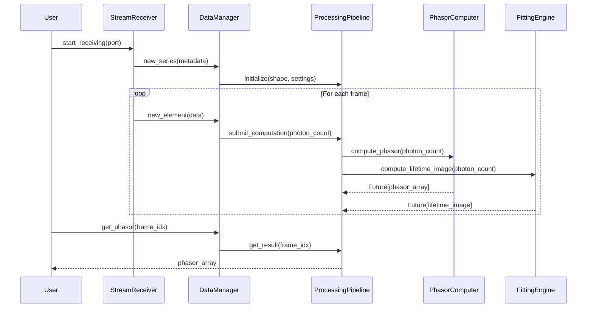

# Design Document

## Overview

The FLIM Processing Library is a standalone Python package that extracts the core data processing logic from napari-live-flim into a reusable, framework-agnostic library. The library provides real-time FLIM data analysis capabilities including phasor computation, curve fitting (RLD and LMA), lifetime image generation, and region-of-interest analysis. 

The design emphasizes:
- **Separation of concerns**: Processing logic is decoupled from UI frameworks (napari, Qt)
- **Asynchronous computation**: Non-blocking processing using thread pools and futures
- **Jupyter-friendly**: Direct NumPy array access and matplotlib compatibility
- **Streaming support**: Real-time processing of UDP data streams from TCSPC hardware
- **Extensibility**: Clean interfaces for custom analysis pipelines

## Architecture

### High-Level Architecture

```
┌─────────────────────────────────────────────────────────────┐
│                    User Application Layer                    │
│              (Jupyter Notebook, Scripts, etc.)               │
└─────────────────────────────────────────────────────────────┘
                              │
                              ▼
┌─────────────────────────────────────────────────────────────┐
│                   FLIM Processing Library                    │
│  ┌──────────────┐  ┌──────────────┐  ┌──────────────┐      │
│  │   Stream     │  │  Processing  │  │  Selection   │      │
│  │   Receiver   │  │   Pipeline   │  │   Analysis   │      │
│  └──────────────┘  └──────────────┘  └──────────────┘      │
│  ┌──────────────┐  ┌──────────────┐  ┌──────────────┐      │
│  │   Phasor     │  │    Fitting   │  │    Data      │      │
│  │   Computer   │  │    Engine    │  │   Manager    │      │
│  └──────────────┘  └──────────────┘  └──────────────┘      │
└─────────────────────────────────────────────────────────────┘
                              │
                              ▼
┌─────────────────────────────────────────────────────────────┐
│                    External Dependencies                     │
│         flimlib, NumPy, SciPy, ThreadPoolExecutor           │
└─────────────────────────────────────────────────────────────┘
```

### Component Interaction Flow



## Components and Interfaces

### 1. StreamReceiver

Handles UDP communication with TCSPC hardware, parsing messages and memory-mapped file access.

```python
class StreamReceiver:
    """Receives FLIM data streams via UDP."""
    
    def __init__(self, port: int, addr: str = "127.0.0.1"):
        """Initialize receiver on specified port."""
        
    def start_receiving(self) -> Iterator[Union[SeriesMetadata, ElementData, EndSeries]]:
        """
        Generator that yields data events as they arrive.
        
        Yields:
            SeriesMetadata: When a new series starts
            ElementData: When a data frame arrives
            EndSeries: When a series ends
        """
        
    def stop_receiving(self):
        """Stop the receiver and close socket."""
```

### 2. DataManager

Manages FLIM data storage, snapshot handling, and delta computation.

```python
class DataManager:
    """Manages FLIM data storage and retrieval."""
    
    def __init__(self, shape: tuple, dtype: np.dtype, delta_mode: bool = False):
        """Initialize data manager with series parameters."""
        
    def add_element(self, seqno: int, frame: np.ndarray):
        """Add a new data element to the series."""
        
    def snapshot(self):
        """Create a snapshot of the current live frame."""
        
    def get_photon_count(self, index: int) -> np.ndarray:
        """
        Get photon count array for a specific frame.
        
        In delta mode, returns difference from previous frame.
        """
        
    def get_frame_count(self) -> int:
        """Return the number of frames (snapshots + live)."""
```

### 3. ProcessingPipeline

Orchestrates asynchronous computation tasks for FLIM analysis.

```python
class ProcessingPipeline:
    """Manages asynchronous FLIM computation tasks."""
    
    def __init__(self, settings: ProcessingSettings, executor: ThreadPoolExecutor = None):
        """Initialize pipeline with processing settings."""
        
    def submit_computation(self, photon_count: np.ndarray, frame_idx: int) -> ComputeTask:
        """
        Submit a new computation task for a frame.
        
        Returns:
            ComputeTask: Handle to access computation results
        """
        
    def update_settings(self, settings: ProcessingSettings):
        """Update settings and invalidate affected computations."""
        
    def get_task(self, frame_idx: int) -> Optional[ComputeTask]:
        """Get the computation task for a specific frame."""
```

### 4. ComputeTask

Encapsulates a set of related computation futures for a single frame.

```python
class ComputeTask:
    """Container for asynchronous computation results."""
    
    intensity: Future[np.ndarray]
    lifetime_image: Future[np.ndarray]
    phasor: Future[np.ndarray]
    phasor_kdtree: Future[KDTree]
    phasor_image: Future[np.ndarray]
    
    def is_done(self) -> bool:
        """Check if all computations are complete."""
        
    def cancel(self):
        """Cancel all pending computations."""
        
    def invalidate(self):
        """Mark task as invalid (needs recomputation)."""
```

### 5. PhasorComputer

Computes phasor coordinates using Fourier transform method.

```python
class PhasorComputer:
    """Computes phasor coordinates from photon count data."""
    
    @staticmethod
    def compute_phasor(photon_count: np.ndarray, params: FlimParams) -> np.ndarray:
        """
        Compute phasor coordinates (g, s) for each pixel.
        
        Args:
            photon_count: 3D array (height, width, time_bins)
            params: FLIM parameters including period and fit range
            
        Returns:
            Array of shape (height, width, 2) with g and s coordinates
        """
        
    @staticmethod
    def build_kdtree(phasor: np.ndarray, scale: float = 1000.0) -> KDTree:
        """
        Build KD-tree for efficient phasor space queries.
        
        Args:
            phasor: Phasor array (height, width, 2)
            scale: Scaling factor for phasor coordinates
            
        Returns:
            KDTree for spatial queries
        """
```

### 6. FittingEngine

Performs curve fitting using RLD and LMA algorithms via flimlib.

```python
class FittingEngine:
    """Performs fluorescence decay curve fitting."""
    
    @staticmethod
    def compute_rld(photon_count: np.ndarray, params: FlimParams) -> RLDResult:
        """
        Compute Rapid Lifetime Determination using triple integral.
        
        Returns:
            RLDResult with tau, chisq, Z, A, and fitted curve
        """
        
    @staticmethod
    def compute_lma(photon_count: np.ndarray, params: FlimParams, 
                    initial_params: List[float]) -> LMAResult:
        """
        Compute Levenberg-Marquardt fitting.
        
        Args:
            initial_params: [Z, A, tau] from RLD as starting point
            
        Returns:
            LMAResult with refined parameters and chisq
        """
        
    @staticmethod
    def compute_lifetime_image(photon_count: np.ndarray, intensity: np.ndarray,
                               params: FlimParams, display: DisplaySettings) -> np.ndarray:
        """
        Generate RGB lifetime image with filtering.
        
        Returns:
            RGB array (height, width, 4) with RGBA values
        """
```

### 7. SelectionAnalyzer

Analyzes regions of interest in spatial or phasor space.

```python
class SelectionAnalyzer:
    """Analyzes selected regions in FLIM data."""
    
    def __init__(self, data_manager: DataManager, pipeline: ProcessingPipeline):
        """Initialize with data and processing pipeline."""
        
    def analyze_spatial_selection(self, mask: np.ndarray, frame_idx: int) -> SelectionResult:
        """
        Analyze a spatial region of interest.
        
        Args:
            mask: Boolean array (height, width) indicating selected pixels
            frame_idx: Frame index to analyze
            
        Returns:
            SelectionResult with averaged histogram and fit results
        """
        
    def analyze_phasor_selection(self, phasor_mask: np.ndarray, frame_idx: int) -> SelectionResult:
        """
        Analyze pixels whose phasors fall within a phasor space region.
        
        Args:
            phasor_mask: Boolean mask in phasor space
            frame_idx: Frame index to analyze
            
        Returns:
            SelectionResult with averaged histogram and fit results
        """
```

### 8. FlimSession

High-level interface that ties all components together.

```python
class FlimSession:
    """High-level interface for FLIM data processing."""
    
    def __init__(self, port: int = None, settings: ProcessingSettings = None):
        """
        Initialize a FLIM processing session.
        
        Args:
            port: UDP port for streaming (optional)
            settings: Processing parameters (optional, uses defaults)
        """
        
    def start_streaming(self):
        """Start receiving data from UDP port."""
        
    def stop_streaming(self):
        """Stop receiving data."""
        
    def load_data(self, photon_count: np.ndarray):
        """Load photon count data from array or file."""
        
    def get_lifetime_image(self, frame_idx: int = -1) -> np.ndarray:
        """Get computed lifetime image for a frame."""
        
    def get_phasor(self, frame_idx: int = -1) -> np.ndarray:
        """Get phasor coordinates for a frame."""
        
    def create_spatial_selection(self, mask: np.ndarray) -> Selection:
        """Create a spatial region of interest."""
        
    def create_phasor_selection(self, bounds: np.ndarray) -> Selection:
        """Create a phasor space region of interest."""
        
    def snapshot(self):
        """Take a snapshot of the current live frame."""
        
    @property
    def settings(self) -> ProcessingSettings:
        """Get current processing settings."""
        
    @settings.setter
    def settings(self, value: ProcessingSettings):
        """Update processing settings."""
```

## Data Models

### Core Data Classes

```python
@dataclass(frozen=True)
class FlimParams:
    """Parameters for FLIM computation."""
    period: float  # Laser period in nanoseconds
    fit_start: int  # Start index for fitting
    fit_end: int  # End index for fitting (exclusive)
    
    def __post_init__(self):
        """Validate parameters."""
        if self.period <= 0:
            raise ValueError("period must be positive")
        if self.fit_start >= self.fit_end:
            raise ValueError("fit_start must be less than fit_end")

@dataclass(frozen=True)
class DisplaySettings:
    """Settings for lifetime image display."""
    max_chisq: float  # Maximum chi-squared for filtering
    min_tau: float  # Minimum lifetime (ns)
    max_tau: float  # Maximum lifetime (ns)
    colormap: str  # Colormap name
    
    def __post_init__(self):
        """Validate settings."""
        if self.min_tau >= self.max_tau:
            raise ValueError("min_tau must be less than max_tau")

@dataclass(frozen=True)
class ProcessingSettings:
    """Combined processing settings."""
    flim_params: FlimParams
    display_settings: DisplaySettings
    delta_snapshots: bool = False

@dataclass(frozen=True)
class SeriesMetadata:
    """Metadata for a FLIM data series."""
    series_no: int
    port: int
    shape: tuple  # (height, width, time_bins)
    dtype: np.dtype

@dataclass
class ElementData:
    """A single frame of FLIM data."""
    series_no: int
    seqno: int  # Sequence number
    frame: np.ndarray  # Photon count array

@dataclass(frozen=True)
class RLDResult:
    """Result from Rapid Lifetime Determination."""
    tau: np.ndarray  # Lifetime values
    chisq: np.ndarray  # Chi-squared values
    Z: np.ndarray  # Background parameter
    A: np.ndarray  # Amplitude parameter
    fitted: Optional[np.ndarray] = None  # Fitted curve

@dataclass(frozen=True)
class LMAResult:
    """Result from Levenberg-Marquardt fitting."""
    param: np.ndarray  # [Z, A, tau]
    chisq: np.ndarray  # Chi-squared values
    fitted: Optional[np.ndarray] = None  # Fitted curve

@dataclass(frozen=True)
class SelectionResult:
    """Result from analyzing a selection."""
    histogram: np.ndarray  # Averaged photon count histogram
    points: np.ndarray  # Selected pixel coordinates or phasor points
    rld: RLDResult  # RLD fit result
    lma: LMAResult  # LMA fit result
    pixel_count: int  # Number of pixels in selection
```

## Correctness Properties


*A property is a characteristic or behavior that should hold true across all valid executions of a system-essentially, a formal statement about what the system should do. Properties serve as the bridge between human-readable specifications and machine-verifiable correctness guarantees.*

### Property 1: Element data storage preserves order

*For any* sequence of element data with sequence numbers, storing them should result in retrieval in the correct order based on sequence numbers.
**Validates: Requirements 1.2, 1.4**

### Property 2: Phasor output shape invariant

*For any* photon count array with shape (height, width, time_bins), the computed phasor array should have shape (height, width, 2).
**Validates: Requirements 2.3**

### Property 3: Phasor NaN propagation

*For any* photon count array containing NaN values at specific pixels, the computed phasor coordinates at those pixels should also be NaN.
**Validates: Requirements 2.4**

### Property 4: Fit range application

*For any* photon count array and fit range [fit_start, fit_end), the fitting algorithm should only use photon counts within that index range.
**Validates: Requirements 2.2, 3.4**

### Property 5: Period parameter affects phasor calculation

*For any* photon count array, computing phasors with different period values should produce different results (unless the data is degenerate).
**Validates: Requirements 2.5**

### Property 6: Phasor Fourier transform correctness

*For any* photon count array, the computed g and s coordinates should match the expected Fourier transform calculation at the fundamental frequency.
**Validates: Requirements 2.1**

### Property 7: LMA uses RLD initialization

*For any* photon count array, when computing LMA fitting, the initial parameters [Z, A, tau] should be taken from the RLD result.
**Validates: Requirements 3.2**

### Property 8: Fitting result completeness

*For any* photon count array, the fitting result should contain tau, chi-squared, and optionally fitted curve values.
**Validates: Requirements 3.3**

### Property 9: RLD triple integral implementation

*For any* photon count array, the RLD tau values should match the expected triple integral calculation.
**Validates: Requirements 3.1**

### Property 10: Display filter excludes high chi-squared

*For any* lifetime image with display settings, pixels where chi-squared exceeds max_chisq should be marked as invalid (NaN or zero intensity).
**Validates: Requirements 4.2**

### Property 11: Display filter excludes out-of-range tau

*For any* lifetime image with display settings, pixels where tau is outside [min_tau, max_tau] should be marked as invalid.
**Validates: Requirements 4.3**

### Property 12: Colormap application

*For any* tau values and colormap, the RGB output should reflect the colormap encoding of normalized tau values.
**Validates: Requirements 4.4**

### Property 13: Intensity modulation

*For any* lifetime image, the RGB intensity should be proportional to the total photon count at each pixel.
**Validates: Requirements 4.5**

### Property 14: RLD applied per pixel

*For any* photon count array, generating a lifetime image should compute RLD fitting for each pixel independently.
**Validates: Requirements 4.1**

### Property 15: Spatial mask extraction

*For any* photon count array and boolean mask, applying the mask should extract photon counts only from pixels where the mask is True.
**Validates: Requirements 5.1**

### Property 16: Selection averaging correctness

*For any* set of selected pixels, the averaged histogram should equal the mean of photon counts across those pixels.
**Validates: Requirements 5.2**

### Property 17: Phasor space selection correctness

*For any* phasor space boundary and phasor array, the selected pixels should be exactly those whose phasor coordinates fall within the boundary.
**Validates: Requirements 5.3**

### Property 18: Selection performs both fits

*For any* selection with valid pixels, the result should contain both RLD and LMA fitting results.
**Validates: Requirements 5.4**

### Property 19: Data access returns NumPy arrays

*For any* data access method (get_phasor, get_lifetime_image, etc.), the return type should be a NumPy ndarray.
**Validates: Requirements 6.2**

### Property 20: Matplotlib compatibility

*For any* visualization data returned by the library, it should be plottable with matplotlib without conversion.
**Validates: Requirements 6.3**

### Property 21: Synchronous result access

*For any* completed computation, requesting the result should return immediately without blocking.
**Validates: Requirements 6.5**

### Property 22: Period validation

*For any* FlimParams with period <= 0, initialization should raise a ValueError.
**Validates: Requirements 7.1**

### Property 23: Fit range validation

*For any* FlimParams where fit_start >= fit_end, initialization should raise a ValueError.
**Validates: Requirements 7.2**

### Property 24: Tau range validation

*For any* DisplaySettings where min_tau >= max_tau, initialization should raise a ValueError.
**Validates: Requirements 7.3**

### Property 25: Parameter update invalidates cache

*For any* processing pipeline with cached results, updating parameters should invalidate computations that depend on those parameters.
**Validates: Requirements 7.4**

### Property 26: Descriptive exceptions

*For any* invalid parameter input, the raised exception should contain a message describing the validation failure.
**Validates: Requirements 7.5**

### Property 27: KDTree query correctness

*For any* phasor KDTree and query with distance threshold, all returned pixel indices should have phasor coordinates within the threshold distance.
**Validates: Requirements 8.2**

### Property 28: NaN to infinity conversion

*For any* phasor array with NaN values, building a KDTree should replace NaN with infinity.
**Validates: Requirements 8.3**

### Property 29: Infinity norm distance

*For any* phasor query, the distance calculation should use the infinity norm (max absolute difference in any dimension).
**Validates: Requirements 8.4**

### Property 30: Snapshot mode independence

*For any* sequence of frames in snapshot mode, each stored frame should be independent (modifying one doesn't affect others).
**Validates: Requirements 9.1**

### Property 31: Delta computation correctness

*For any* two consecutive frames in delta mode, the delta should equal current_frame - previous_frame.
**Validates: Requirements 9.2, 9.3**

### Property 32: Future return type

*For any* computation submission, the returned object should be a Future or contain Future objects.
**Validates: Requirements 10.2**

### Property 33: Task cancellation

*For any* invalidated task with pending futures, those futures should be cancelled.
**Validates: Requirements 10.3**

### Property 34: Non-blocking status check

*For any* computation task, checking its completion status should not block the calling thread.
**Validates: Requirements 10.4**

### Property 35: Task restart after cancellation

*For any* cancelled task, it should be possible to create and start a new task for the same computation.
**Validates: Requirements 10.5**

## Error Handling

### Error Categories

1. **Input Validation Errors**
   - Invalid parameter values (negative period, invalid fit ranges)
   - Mismatched array shapes
   - Invalid data types
   - Strategy: Raise `ValueError` with descriptive messages at parameter initialization

2. **Network Errors**
   - UDP socket binding failures
   - Port already in use
   - Message parsing errors
   - Strategy: Raise `IOError` or `socket.error` with context

3. **Computation Errors**
   - Numerical instability in fitting
   - Memory allocation failures
   - Thread pool exhaustion
   - Strategy: Log warnings for numerical issues, raise `RuntimeError` for resource issues

4. **Data Errors**
   - Missing or corrupted frame data
   - Sequence number gaps
   - Unexpected data shapes
   - Strategy: Log warnings and use NaN for missing data, raise exceptions for shape mismatches

### Error Handling Patterns

```python
# Parameter validation at initialization
@dataclass(frozen=True)
class FlimParams:
    def __post_init__(self):
        if self.period <= 0:
            raise ValueError(f"period must be positive, got {self.period}")
        if self.fit_start >= self.fit_end:
            raise ValueError(f"fit_start ({self.fit_start}) must be less than fit_end ({self.fit_end})")

# Graceful degradation for numerical issues
def compute_phasor(photon_count, params):
    try:
        result = flimlib.GCI_Phasor(...)
        return result
    except Exception as e:
        logging.warning(f"Phasor computation failed: {e}")
        return np.full(photon_count.shape[:-1] + (2,), np.nan)

# Resource cleanup on errors
def start_receiving(self):
    try:
        self.socket.bind((self.addr, self.port))
    except OSError as e:
        self.socket.close()
        raise IOError(f"Failed to bind to port {self.port}: {e}")
```

## Testing Strategy

### Unit Testing

The library will use **pytest** as the testing framework. Unit tests will cover:

1. **Parameter Validation**
   - Test FlimParams, DisplaySettings, ProcessingSettings with valid and invalid inputs
   - Verify appropriate exceptions are raised with descriptive messages

2. **Data Structures**
   - Test DataManager snapshot and delta modes
   - Test ElementData storage and retrieval
   - Verify frame ordering

3. **Core Algorithms**
   - Test phasor computation with known inputs
   - Test RLD and LMA fitting with synthetic decay curves
   - Test lifetime image generation with controlled data

4. **Selection Analysis**
   - Test spatial masking with various mask shapes
   - Test phasor space queries with KDTree
   - Test histogram averaging

5. **Asynchronous Behavior**
   - Test Future creation and completion
   - Test task cancellation and restart
   - Test cache invalidation

### Property-Based Testing

The library will use **Hypothesis** for property-based testing. Each property-based test will run a minimum of 100 iterations.

**Property test tagging format**: Each property-based test must include a comment with the format:
`# Feature: flim-processing-library, Property {number}: {property_text}`

Example:
```python
# Feature: flim-processing-library, Property 2: Phasor output shape invariant
@given(photon_count=arrays(dtype=np.float32, shape=st.tuples(
    st.integers(1, 100), st.integers(1, 100), st.integers(10, 256))))
def test_phasor_shape_invariant(photon_count):
    params = FlimParams(period=0.04, fit_start=0, fit_end=photon_count.shape[-1])
    phasor = PhasorComputer.compute_phasor(photon_count, params)
    assert phasor.shape == photon_count.shape[:-1] + (2,)
```

**Generator strategies**:
- Photon count arrays: 3D arrays with realistic shapes (1-256 for spatial, 10-256 for time)
- Parameters: Valid ranges for period (0.01-1.0 ns), fit ranges within data bounds
- Masks: Boolean arrays matching spatial dimensions
- Phasor coordinates: Values in valid range [0, 1] for g, [-0.5, 0.5] for s

**Edge cases handled by generators**:
- Empty selections (no True values in mask)
- NaN values in photon counts
- Boundary fit ranges (fit_start=0, fit_end=max)
- Single-pixel images
- Very large chi-squared values

### Integration Testing

Integration tests will verify component interactions:

1. **End-to-End Streaming**
   - Use SeriesSender to simulate UDP data stream
   - Verify FlimSession receives and processes data correctly
   - Test snapshot creation during streaming

2. **Processing Pipeline**
   - Submit multiple frames for processing
   - Verify all computation tasks complete
   - Test parameter updates during processing

3. **Selection Workflow**
   - Create selections on processed data
   - Verify selection results match expected values
   - Test multiple simultaneous selections

### Test Data

- **Synthetic decay curves**: Generated with known tau values for validation
- **Recorded FLIM data**: Small sample datasets from real acquisitions
- **Edge case data**: Arrays with NaN, zeros, extreme values

## Dependencies

### Required Dependencies

- **Python**: >= 3.8
- **NumPy**: >= 1.20 (array operations)
- **SciPy**: >= 1.7 (KDTree for spatial queries)
- **flimlib**: >= 1.0 (RLD and LMA fitting algorithms)
- **matplotlib**: >= 3.3 (colormaps, optional for visualization helpers)

### Optional Dependencies

- **Hypothesis**: >= 6.0 (property-based testing, dev only)
- **pytest**: >= 7.0 (unit testing, dev only)
- **jupyter**: >= 1.0 (notebook support, optional)

### Removed Dependencies

The following dependencies from napari-live-flim are **NOT** required:

- napari (UI framework)
- qtpy, PyQt5, PySide2 (Qt bindings)
- vispy (OpenGL visualization)
- superqt (Qt utilities)

## Implementation Notes

### Performance Considerations

1. **Asynchronous Computation**: Use ThreadPoolExecutor to parallelize frame processing
2. **Lazy Evaluation**: Compute results only when requested via Future.result()
3. **Memory Management**: Use memory-mapped files for large datasets
4. **Vectorization**: Leverage NumPy broadcasting for per-pixel operations

### Jupyter Notebook Integration

```python
# Example notebook usage
from flim_processing import FlimSession

# Create session with default settings
session = FlimSession(port=4444)

# Start streaming
session.start_streaming()

# Get results (blocks until computation completes)
lifetime_img = session.get_lifetime_image()
phasor = session.get_phasor()

# Display with matplotlib
import matplotlib.pyplot as plt
plt.imshow(lifetime_img)
plt.show()

# Create selection
mask = create_circular_mask(center=(128, 128), radius=20)
selection = session.create_spatial_selection(mask)
print(f"Average tau: {selection.result.lma.param[2]}")
```

### Extensibility Points

1. **Custom Fitting Algorithms**: Subclass FittingEngine to add new fitting methods
2. **Custom Colormaps**: Register new colormaps in DisplaySettings
3. **Custom Selection Types**: Extend SelectionAnalyzer for new selection geometries
4. **Data Sources**: Implement alternative data sources beyond UDP streaming

## Migration Path from napari-live-flim

For users migrating from napari-live-flim:

1. **Replace Controller with FlimSession**: High-level API remains similar
2. **Remove UI code**: Replace napari layer access with direct array access
3. **Update visualization**: Use matplotlib instead of napari/vispy
4. **Async handling**: Use Future.result() for synchronous access or add callbacks
5. **Settings management**: Use ProcessingSettings dataclass instead of Qt widgets
